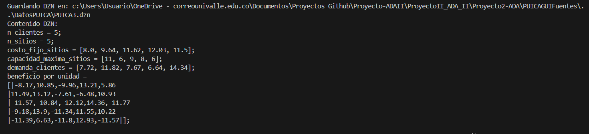
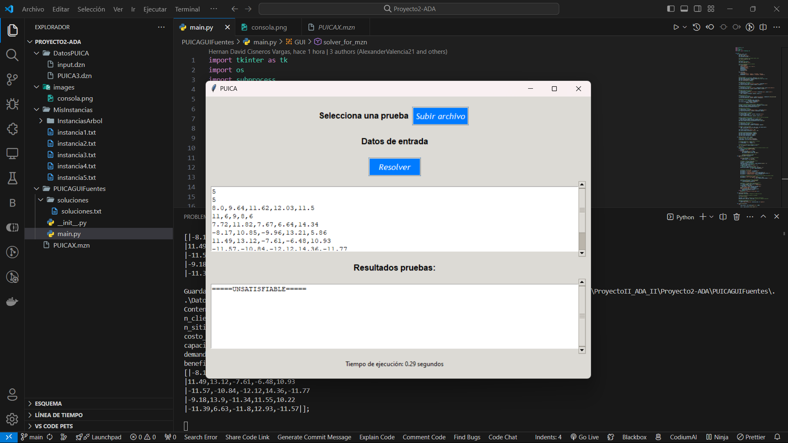

# Problema de la Ubicación de Instalaciones de Capacidad Acotada (PUICA)

El problema a resolver es decidir donde ubicar un cierto
número de instalaciones de una planta de producción, entre un cierto número de sitios posibles para hacerlo, teniendo en cuenta las necesidades de los clientes, y cierto criterio económico de optimización. Se ha desarrollado un modelo genérico que resuelve el problema PUICA, utilizando el lenguaje de modelado Minizinc, el cual fue puesto a prueba con una serie de instancias diferentes del problema, que buscan probar su correctitud y analizar el comportamiento del mismo haciendo uso de los resultados de prueba obtenidos, en términos de optimización. Asimismo, se ha desarrollado una interfaz gráfica en Python, que facilita la configuración y ejecución del modelo construido, permitiendo visualizar los resultados de manera interactiva.

- [Link al Informe](https://docs.google.com/document/d/1-jwHge9unAaSDajX8AVxS8L4MJ2nIoe4YHUquVh-0qA/edit?usp=sharing)
- [Link al Video Explicativo de la Interfaz Gráfica]()


## Grupo de Trabajo

- Juan Sebastian Cifuentes Vallejo
- Hernan David Cisneros Vargas
- Jhon Alexander Valencia Hilamo
- Kevin Alejandro Velez Agudelo


## Requisitos para Ejecución de la Aplicación

La interfaz gráfica fue desarrollada en Python junto a la librería **tkinter**. Como se había mencionado, el modelo de optimización fue creada en la herramienta MiniZinc. En este repositorio se adicionan unas pruebas en formato txt con las que se pueden usar en la interfaz. Se menciona que el rendimiento de la aplicación depende de los recursos de Hardware en donde se ejecute este. 

A continuación se mencionan los requisitos necesarios para ejecutar la aplicación correctamente:

- Instalación de MiniZinc
- Es necesario identificar que el binario de esta aplicación este alojado en el PATH del sistema operativo. En caso de del sistema operativo Windows se utilizó la ruta 'C:\Program Files\MiniZinc' en las variables de entorno.
- Tener instalado Python y la librería tkinter.


Infraestructura del Proyecto:
-

Los directorios y archivos del proyecto son los siguientes: 


- Carpeta DatosPUICA: En esta carpeta se alojarán los archivos con formato .dzn necesarios para que el programa se ejecute correctemente. La aplicación genera este tipo de archivos en tiempo de ejecución, por medio de archivos txt. 

- Carpeta MisInstancias: En esta carpeta se encuentran cinco pruebas que el grupo generó para comprobar diferentes parámetros de la aplicación, pueden ser usados por el usuario. También en esta se encuentra la subcarpeta 'InstanciasArbol', en donde se encuentran algunas instancias que se usaron para generar gráficos de árboles con el solver GeCode Gist 6.3.0.

- Carpeta PUICAGUIFuentes: En esta carpeta se encuentra el archivo main.py que ejecuta la apliación y la GUI. Aqui también se encuentra una carpeta denominada 'soluciones' en donde se generará un archivo 'soluciones.txt' en donde estarán las soluciones de la prueba que se ejecute en la aplicación.

- Carpeta images: En esta carpeta se alojan imágenes que ayudan a explicar muchas partes de la aplicación como su ejecución.

- Archivo PUICAX.mzn: Este archivo es el modelo de optimización creado en la herramienta MiniZinc. La GUI del proyecto utiliza este archivo para ejecutar las pruebas que sean anexadas por medio de la GUI.

- Archivo Informe.pdf: Este es el documento del proyecto, en este se analiza la aplicación, se explica el modelo utilizado y otros aspectos estadísticos sobre las pruebas ejecutadas en esta aplicación.

- Archivo Readme.txt: Este archivo explica brevemente los archivos contenidos en la aplicación y pasos a seguir para la ejecución de este.  

## Ejecución de la Aplicación

Para la ejecución de esta aplicación, se debe descargar o clonar este repositorio. Una vez guardado en la máquina local se debe abrir este con la IDE de su preferencia. Luego, se debe ejecutar el archivo main.py, para ello se abre una consola en el IDE y se coloca la ubicación de la carpeta PUICAGUIFuentes de la siguiente manera: 

```bash
  cd .\PUICAGUIFuentes\
```

Después, se debe ejecutar el archivo main.py, con el siguiente comando:

```bash
  pyhton main.py
```

Con esto se abrirá la GUI de la aplicación, en este verá varias secciones. La primera sección es donde se debe seleccionar una prueba, con el botón *subir archivo* se abrirá el explorador de archivos del sistema operativo, se debe seleccionar una prueba en formato .txt para probar la aplicación, puede probar las pruebas anexadas en la carpeta **MisInstancias**. Por consiguiente, si el archivo es aceptado se llenará el primer campo *Datos de Entrada* donde se mostrará la información del documento txt seleccionada. El siguiente paso, es presionar el botón *Resolver*. La aplicación generará un archivo dzn con el nombre del archivo seleccionado. Los archivos dzn son aquellos que necesita el modelo para entender las variables de entrada y llevar a cabo la ejecución correctamente. Como pasos finales de la aplicación, se mostrará el contenido del archivo dzn generado por medio de la consola, tal como se puede observar en la siguiente imagen de ejemplo:



En el segundo campo de *Resultados de Prueba* se visualiazará los resultados arrojados por el modelo. La aplicación sobreescribirá estos resultados en el archivo *soluciones.txt* que se encuentra en la carpeta *soluciones* para que estos puedan ser manipulados, si se desea. Para entender de mejor manera el funcionamiento de la aplicación se recomienda ver el **video explicativo** de la aplicación. Se anexa una imagen sobre la GUI.



**NOTA:** La herramienta puede generar muchos resultados, el único resultado que es importante es el último generado.  

Para cambiar el Solver de la aplicación, se puede cambiar manualmente entre el bloque de las líneas 229 y 233 del archivo main.py. 
Se destacá que en esta aplicación se usaron los solvers COIN-BC y HiHGS. 


## Conclusiones

